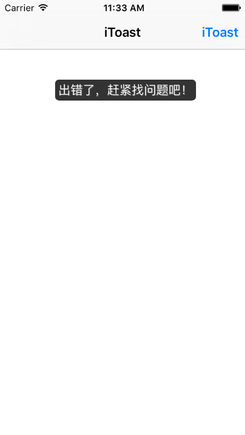
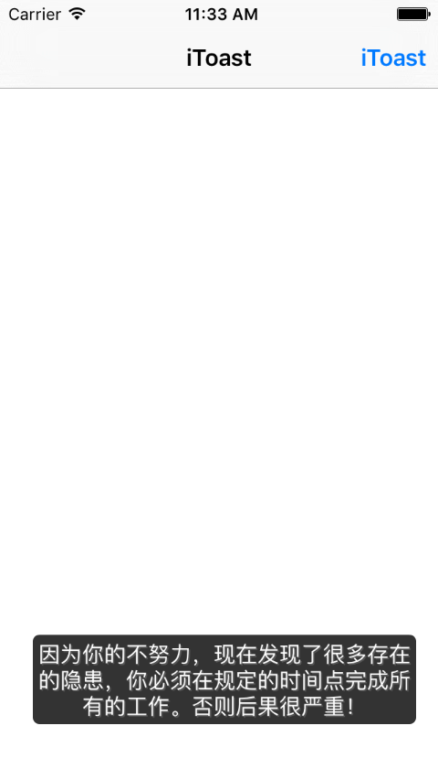

# iToast
提示信息弹窗

#使用示例
~~~ javascript
#import "iToast.h"
// 或
#import "iToast+SYCategory.h"

NSArray *messages = @[@"出错了，赶紧找问题吧！", @"正确！", @"因为你的不努力，现在发现了很多存在的隐患，你必须在规定的时间点完成所有的工作。否则后果很严重！"];
NSArray *positons = @[[NSNumber numberWithInteger:iToastPositionBottom], [NSNumber numberWithInteger:iToastPositionCenter], [NSNumber numberWithInteger:iToastPositionTop]];
NSString *message = messages[arc4random() % messages.count];
NSNumber *position = positons[arc4random() % positons.count];
// 方法1
//    [[iToast shareIToast] showText:message postion:position.integerValue];
// 方法2 扩展类方法
if (iToastPositionTop == position.integerValue)
{
    [iToast alertWithTitle:message];
}
else if (iToastPositionCenter == position.integerValue)
{
    [iToast alertWithTitleCenter:message];
}
else if (iToastPositionBottom == position.integerValue)
{
    [iToast alertWithTitleBottom:message];
}
~~~

#效果图
* 顶端提示效果

 
* 中间提示效果

 
* 底端提示效果

 
